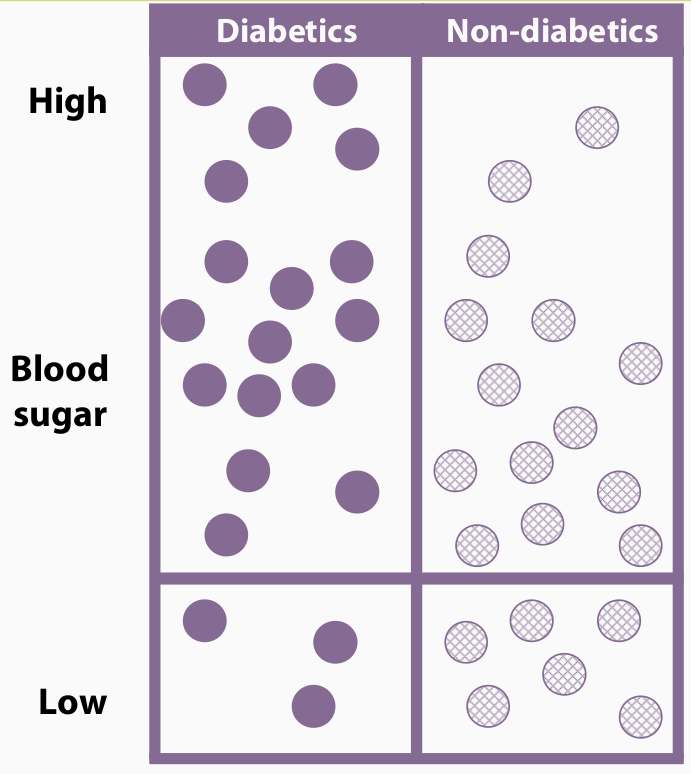
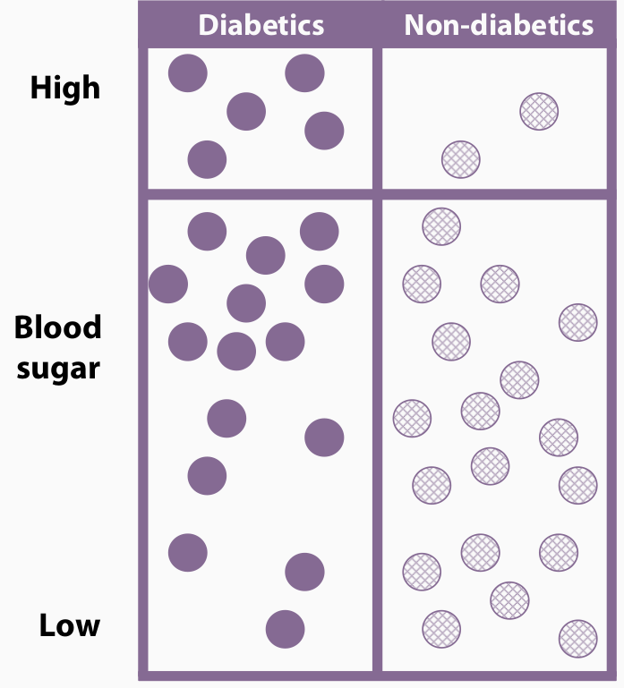
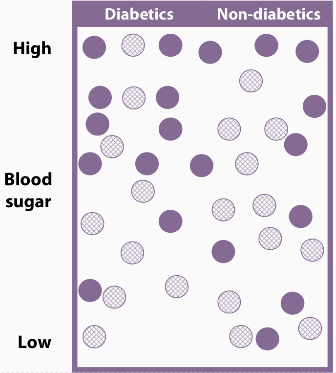
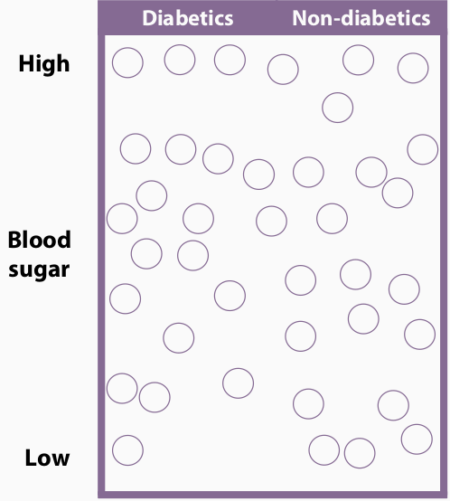
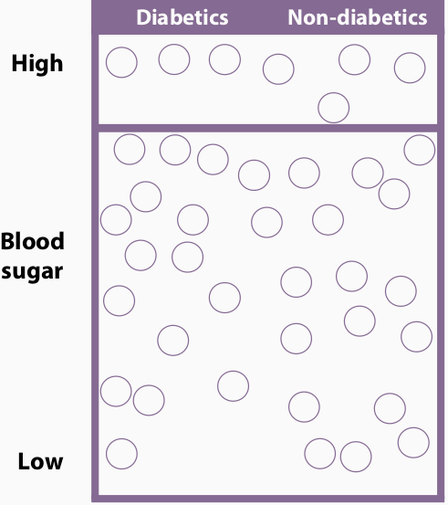
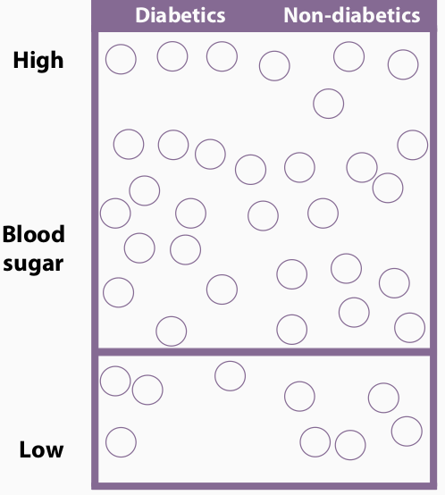
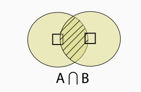

```{r xaringan-themer, include = FALSE}
library(xaringanthemer)
mono_light(
  base_color = "#1c5253",
  header_font_google = google_font("Josefin Sans"),
  # text_font_google   = google_font("M PLUS Rounded 1c", "300", "300i"),
  text_font_google = google_font("Noto Sans JP", "300", "300i"), 
  code_font_google   = google_font("Droid Mono"),
  text_bold_color = "#B03A2E",
  title_slide_background_image = "pic/pylori.jpg"
)
# write_xaringan_theme(text_bold_color = "#FF4333")
```


class: middle
# 目標 <br> objectives

- 確率論の基本を理解する <br> Understand the basic theories of probability

- 確率ツリーを利用して確率を計算する <br> Draw a probability tree and obtain probability from it

- ベイズの定理を実際に臨床的な疑問に応用する <br> Apply Bayes' Theorem to clinical examples

- 検査法を組み合わせした場合の感度と特異度 <br> Know how to calculate sensitivity and specificity when combining methods

---
class: middle
# 確率 <br> probability

- 確率とは？<br> What is probability?

    - コインを投げて，表が出る確率は0.5 <br> when tossing a coin the probability of obtaining a head is 0.5
    - 明日長久手市で雨が降る確率は0.8 <br> The probability that it will rain tomorrow in Nagakute is 0.8


- 確率の正式な定義 <br> Formally define the probability: 

$$
P(\text{event of interest}) = \lim_{n \rightarrow \infty}\frac{n \text{ of events}}{\text{sum of  }n}
$$


---
class: middle
# 医学での確率 <br> probability in medicine

- 極めて重要な概念である <br> probability is crucial to medical science

    - イベントの予測 <br> predicting events
        - Aさん（50歳，男性，心血管疾患病歴なし，運動不足，脳卒中家族歴あり，糖尿病）のこれから10年の間心臓病で死亡する確率？<br> What is the probability that a particular patient A will die from heart disease in the next 10 years?
    - 変数と変数との関係性を評価する <br> assessing whether two characterisitcs are related 
        - ピロリ菌感染と胃がん発生との関係 <br> Is _H. pylori_ infection related with the development of gastric cancer?

---
class: middle
## 実例 Example

- 臨床疑問：ピロリ菌の感染者，と非感染者の中に，胃がんの有病率はそれぞれどれぐらいあるでしょうか？ <br> What is the prevalence of gastric cancer patients in people infected with _H. pylori_, and in those who are _H. pylori_ free?

- 研究デザイン：集団から無作為的にサンプルを選んで来て，そのサンプルの中で，胃がん患者 $(A)$（ではない $(\bar{A})$）人数，それからピロリ菌の感染者 $(S)$（そうではない $(\bar{S})$）の人数をカウントする．<br> Randomly select a number of individuals from the population and record whether they have gastric cancer $(A)$ or not $(\bar{A})$, whether or not they were infected with _H. pylori_ ( $S$ or $\bar{S}$).

- （神様しか知らない）真の値：ある集団のピロリ菌感染率は70%，そのうち15%の感染者が胃がん患者で，非感染の残りの30%の人では，胃がんの患者の割合はわずかの3%．<br> True prevalence of _H. pylori_ in the population is 70% and that 15% of which suffer gastric cancer, whereas only 3% of people who are _H. pylori_ free have gatric cancer. 

---
class: middle
# 確率論の公理 <br> axioms of probability

1. $0 \leqslant P(A) \leqslant 1$ for any event $A$; 

2. $P(\Omega) = 1$ where $\Omega$ is the total sample space (全標本空間); 

3. For mutually exclusive events (排反事象) $A_1, \dots, A_n$:  $$P(A_1 \cup A_2 \cup \dots \cup A_n) = P(A_1) + P(A_2) +\cdots + P(A_n)$$


???

排反事象: はいはんじしょう

---
class: middle
# 条件付き確率 <br> conditional probability

胃がん患者 $(A)$，とピロリ菌感染者 $(S)$ の２つのイベントを考えてください：

- もしAさんがピロリ菌感染している，Aさんが同時に胃がん患者である確率はどれぐらい？<br> Suppose we know that an individual is infected with _H. pylori_. What, then, is the probability that they suffer from gastric cancer?

- これは条件付き確率と呼ばれる，つまり，**感染していることが前提で**，そのうち胃がんの割合． <br> we call this conditional probability of $A$ "given" $S$.

- 条件付き確率の記載法: $P(A|S)$ <br> the probability that $A$ occurs, given or conditional on $S$ occuring.

条件付き確率もとても重要な概念で，例えば，以下の質問は典型的な条件付き質問：
高血圧の患者Aさん, これから5年間の間，心筋梗塞に罹患する確率．

---
class: middle
# 条件付き確率定義 <br> Defining conditional probability 

$$P(A|S) = \frac{P(A\cap S)}{P(S)}$$


$$
\Rightarrow  P(A\cap S) = P(S)P(A|S)
$$


---
class: middle, inverse, center
# 確率ツリー <br> Probability trees


---
class: middle
## 実例 Example


#### 成人での喫煙者の割合は20% <br> Prevalence of smoking is 20% among adults, i.e. $P(S) = 0.2$

#### 喫煙者の9%，非喫煙者の7%は喘息を罹っている <br> 9% of smokers and 7% of non-smokers have asthma, i.e. $P(A|S)= 0.09, P(A|\bar{S})  = 0.007$

#### Aさんは喫煙者かつ喘息患者の確率を求めよ <br> What is the probability that someone has asthma and is a smoker $P(A\cap S) =?$

---
class: middle
background-image: url("./pic/probability_tree.png")
background-position: 50% 50%
background-size: contain


---
class: middle, bottom
background-image: url("./pic/probability_tree.png")
background-position: 50% 50%
background-size: contain

$$
P(A\cap S) = P(S)\times P(A|S) = 0.018
$$

---
class: middle
# 質問&宿題 <br> Question & Homework - (1)

コスタリカのある村で全住民を対象とした消化器内の鉤虫(hookworm)感染の有無を，便を用いて検査した結果：

| 年齢層 <br> Age | 年齢層割合 <br> age group proportion | 年齢層ごと感染者割合 <br> proportion infected in age group |
|:----------:|:-------------------------------:|:-----------------------------------------------------:|
|     0-4    |               0.20              |                          0.09                         |
|     5-9    |               0.18              |                          0.25                         |
|    10-19   |               0.22              |                          0.43                         |
|    20-39   |               0.24              |                          0.46                         |
|     40+    |               0.16              |                          0.37                         |

???

鉤虫(hookworm)　こうちゅう

---
class: middle
# 質問&宿題 <br> Question & Homework - (1)

ある村民がランダムに選ばれた．確率ツリーを実際に描いて，この村民に関する以下の確率を計算せよ．計算の過程も記入してください．

1. 年齢が10-19歳である確率; (10%)
2. 年齢が10-19歳で，かつ鉤虫を感染している確率; (10%)
3. 年齢が10-39歳である確率；(10%)
4. 年齢が10-39歳で，かつ鉤虫を感染している確率; (10%)
4. 年齢が10-39歳で，かつ鉤虫を感染していない確率; (15%)
4. 鉤虫を感染している確率; (15%)
5. 実際に村民の年齢を聞いた結果，年齢は10-39歳で答えてくれた，この村民が鉤虫を感染している確率．(30%)

---
class: middle
# 逆条件 <br> Reverse conditioning

我々は逆条件を利用し，確率を出したい場合が多い <br> We often wish to reverse the conditioning in probabilities:

例えば，胃がん治療専門クリニックでは，どれぐらいの医療資源をピロリ菌除菌治療に投入すべきかを知りたい．<br> For example, suppose an gastric cancer clinic wants to know how many resources to dedicate to anti-_H. pylori_ treatment.

- 専門医は，胃がん患者の中に，_H. pylori_ 感染者の割合を算出したい．<br> The clinic would want to know what proportion of gastric cancer patients were actually infected with _H. pylori_, i.e. $P(S|A) = ?$.

- しかし，条件付きの確率だけわかる <br> we only have information about $P(A|S)$

---
class: middle
# ベイズの定理 I <br> Bayes theorem I

- We can express $P(A\cap S)$ in two ways: 

$$
\begin{aligned}
P(A\cap S) & = P(A|S)P(S) \\
& \text{or} \\ 
P(A\cap S) & = P(S|A)P(A)
\end{aligned}
$$

- Equating the two, we have: 

$$
\begin{aligned}
\Rightarrow P(S|A)P(A) & = P(A|S)P(S) \\
P(S|A) & = \frac{P(A|S)P(S)}{P(A)}
\end{aligned}
$$

---
class: middle
# ベイズの定理 II <br> Bayes theorem II

- Because 

$$
\begin{aligned}
P(A) & = P(A\cap S) + P(A \cap \bar{S}) \\
     & = P(A|S)P(S) + P(A|\bar{S})P(\bar{S})
\end{aligned}
$$


- So, we have: 

$$
\begin{aligned}
P(S|A) = \frac{P(A|S)P(S)}{P(A|S)P(S) + P(A|\bar{S})P(\bar{S})}
\end{aligned}
$$

これは**ベイズの定理**．<br> This is Bayes' Theorem


---
class: middle
## ベイズの定理の応用 <br> Apply Bayes' Theorem 


---
class: middle, bottom
background-image: url("./pic/probability_tree.png")
background-position: 50% 30%
background-size: contain

ある喘息患者が来院して，医師のあなたはベイズの定理を応用し，この患者が喫煙者である確率を求めてみた．

---
class: middle, bottom
background-image: url("./pic/probability_tree.png")
background-position: 50% 25%
background-size: contain

$$P(S|A) = \frac{P(A|S)P(S)}{P(A|S)P(S) + P(A|\bar{S})P(\bar{S})} = \frac{0.09\times0.2}{0.09\times0.2 + 0.07\times0.8} = 0.2432$$


---
class: middle
### 嚢胞性線維症(CF)スクリーニングテスト

- CFは遺伝子変異を原因とする劣性遺伝性疾患です．<br> Cystic fibrosis is an inherited disease

- 汗中クロライド濃度テストは診断に使うゴールドスタンダード．<br> The sweat chloride test is the gold standard diagnostic test. 

- 低所得国においては，簡易な測定方法がより適宜かもしれない．<br> In low income settings the simpler sweat conductivity test may be more appropriate. 

簡易測定法の属性：

- CF患者では，陽性結果になる確率は $P(+ve | CF) = 0.875$
- 言い換えれば，この測定法の**感度(sensitivity)**は $0.875$

- CF患者じゃない人で，陽性結果が出る確率は $P(+ve|\bar{CF}) = 0.004$
- つまり，**特異度(specificity)**は $P(-ve|\bar{CF}) = 1-0.004 = 0.996$


???

嚢胞性線維症のうほうせいせんいしょう

---
class: middle

# スクリーニングテスト <br> Screen test

実際普段臨床の場で，我らが最も知りたいのは，ある患者がスクリーンテスト陽性の結果 $P(+ve)$ を持って外来に来る時に，**この患者が本当に嚢胞性線維症(CF)を罹っている確率 $P(CF|+ve)$．**

<br>

The question we really want to answer is: "if a patient has a positive sweat conductivity test $P(+ve)$, **what is the probability that the patient has CF $P(CF|+ve)$?**"

つまり，**陽性的中率，positive predictive value (PPV), $P(CF|+ve)$**

---
class: middle, center

## ベイズの定理をこの例に適用する

仮に，この集団ではCFの有病率は $P(CF) = 0.035$<br> Say the probability of CF in the population is $P(CF) = 0.035$.

$$
\begin{aligned}
P(+ve|CF) & = 0.875 \\ 
    P(CF) & = 0.0325 \\
P(+ve|\bar{CF}) & = 0.004 \\
\end{aligned}
$$
<br><br>
$$
P(CF|+ce) = ?
$$


---
class: middle, center

## ベイズの定理をこの例に適用する

仮に，この集団ではCFの有病率は $P(CF) = 0.035$．<br> Say the probability of CF in the population is $P(CF) = 0.035$.

$$
\begin{aligned}
P(+ve|CF) & = 0.875 \\ 
    P(CF) & = 0.0325 \\
P(+ve|\bar{CF}) & = 0.004 \\
\end{aligned}
$$

**陽性的中率，Positive Predicitve Value, PPV, $P(CF|+ve)$ **


$$
\begin{aligned}
P(CF|+ve) & = \frac{P(+ve|CF)P(CF)}{P(+ve|CF)P(CF) + P(+ve|\bar{CF})P(\bar{CF})} \\ 
          & = \frac{0.875\times0.0325}{0.875\times0.0325 + 0.004\times(1-0.0325)} \\
          & = 0.88
\end{aligned}
$$


---
class: middle

- この集団ではCFの有病率は $P(CF) = 0.035$ <br> $\Rightarrow$ テスト行う**前**の確率のため，**事前確率(prior probability)**とも呼ばれる．

- 陽性的中率，Positive Predicitve Value, PPV, $P(CF|+ve) = 0.88$ <br> $\Rightarrow$ はテストを行う**後**の確率のため，**事後確率(posterior probability)**とも呼ばれる．

- つまり，スクリーニングテストを行った後，この患者がCFである確率が，テストを行った前の0.035から，0.88に更新された．


---
class: middle

# 質問&宿題 <br> Question & Homework - (2)

例えば，某集団でのHIVの感染率は事前の調査の結果，0.001と推定される．あるスクリーニング検査法の感度(sensitivity)と特異度(specificity)はそれぞれ0.99, 0.98で検査法を開発した製薬メーカーさんから提供された．例えば患者Bさんがこの検査法で陽性の結果が得られた，Bさんが本当にHIVを感染している確率を算出せよ(30%)．この結果についてコメントしよ(35%)．(計算の過程35%)


---
class: middle, center

## スクリーニングテストの<br>妥当性・信頼性 <br> validity of a screening test

---
class: middle

### 感度 sensitivity 

- 感度は本当に病気のある人がテスト受けて陽性が出る**条件付き確率** $P(+ve|+D)$ <br> sensitivity is defined as the proportion of people with the disease who are test positive. 

- 感度が低い場合，多くの患者がこの検査法でピックアップできず，**偽陰性 (false negative)**と呼ばれる．

### 特異度 specificity

- 特異度は本当に病気がない人がテスト受けて陰性が出る**条件付き確率** $P(-ve|-D)$ <br> specificity is defined as the proportion of people without the disease who are found test negative.

- 特異度が低い場合，多くの非患者がこの検査法で患者としてラベル付けられる，**偽陽性 (false positive)**と呼ばれる．

---
class: middle
## 現状 reality


#### **集団全員**が病気であるかどうかを事前にわかること自体は不可能

#### 同じ病気の検査法がたくさん開発され，そのうち最も信頼性の高い方法を**ゴールドスタンダード (gold standard)** として採用される
	- 侵襲的，かつ高価の方法が多い It is often invasive or expensive

#### すべてのサンプルに適応し，他の検査法をこの**ゴールドスタンダードの結果を真の結果**として評価することが多い

---
class: center, top, inverse
background-image: url("./pic/sensitivity.png")
background-position: 50% 80%
background-size: contain

### Gold standard and test comparisons

---
class: middle

## 検査値自体は連続値の場合が多い

#### 検査結果はきれいに患者と非患者分ける時はあるが，きれいに区別できない時も多いだろう <br> Distribution of biologic measurements in humans **may or may not permit easy separation** of diseased from non-diseased individuals, based upon the value of the measurement


---
class: center, top, inverse
background-image: url("./pic/tuberculin.png")
background-position: 50% 90%
background-size: contain

### 結核菌の反応試験 tuberculin reaction test


---
class: center, top, inverse
background-image: url("./pic/SBP.png")
background-position: 50% 90%
background-size: contain

### 収縮期血圧の分布 <br> distribution of systolic blood pressure

---
class: middle

### カットオフ値を変更したらどうなる？

- 2型糖尿病の検査を例にする
  
  - 診断法：[**経口ブドウ糖負荷試験 (oral glucose tolerance test, OGTT)**](https://ja.wikipedia.org/wiki/%E7%B5%8C%E5%8F%A3%E3%83%96%E3%83%89%E3%82%A6%E7%B3%96%E8%B2%A0%E8%8D%B7%E8%A9%A6%E9%A8%93)
  
  - スクリーニング検査法：**空腹時血糖値の検査 fasting plasma glucose** <br> faster, easier, more convenient, and less expensive.
	  

---
class: center, top, inverse
background-image: url("./pic/DMnoDM.png")
background-position: 50% 90%
background-size: contain


---
class: middle

### 低い値をカットオフ値とする

.pull-left[

]

.pull-right[
<br><br><br>

|   | Diabetes | Non-Diabetes |
|:-:|:--------:|:------------:|
| + |    17    |      14      |
| - |     3    |       6      |
| n |    20    |      20      |

$P(+ve|+D) = 17\div20 = 85\%$ <br>

$P(-ve|-D) = 6\div20 = 30\%$
]

---
class: middle

### 高い値をカットオフ値とする

.pull-left[

]

.pull-right[
<br><br><br>

|   | Diabetes | Non-Diabetes |
|:-:|:--------:|:------------:|
| + |    5     |       2      |
| - |    15    |      18      |
| n |    20    |      20      |

$P(+ve|+D) = 5\div20 = 25\%$ <br>

$P(-ve|-D) = 18\div20 = 90\%$
]

---
class: middle

### 実際では，糖尿病と非糖尿病は混ざっている

There is no line separating the two groups, and the **subjects are mixed**. They are **not labeled.**

.pull-left[

]

.pull-right[

]

---
class: middle

.pull-left[
高いカットオフ値を使う時は7人が糖尿病に報告され．


]

.pull-right[
低いカットオフ値を使うとその人数が31になる．


]

---
class: middle

### 何がわかったか？ What did we learnt?

- 違うカットオフを使うと感度と特異度が変わる． <br> Different cut-off points yield different sensitivities and specificities. 

- たくさん真のネガティブを確認したい場合，**偽陰性(false negative)**もそれに連れて多くなる．<br> The cut-off point that identifies more true negatives will also identify more false negatives. 

- たくさん真のポジティブを確認したい場合，**偽陽性(false positive)**もそれに連れて多くなる．<br> The cut-off point that identifies more true positives will also identify more false positives.

---
class: middle

### どこで切るべき？ <br> Where to draw the cut-point?

- もし診断法が侵襲的であり，もしくはとても高価な方法なら <br> If the diagnostic test is expensive or invasive:
	- 偽陽性をできるだけ減らそう <br> Minimize false positives.
	- つまり，**特異度の高い方法を選ぶべき．**<br> Choose a cut-off point with high specificity.
	
- もし一例を見逃しても害がとても高い場合(致死率が高い病気かつ見つかったらすぐに治すことが可能，もしくはその病気は感染力が非常に高く，広がることが大変になる) <br> If the penalty for missing a case is high (the disease is fatal and treatment exists, or disease easily spreads): 
	- 真陽性をできるだけあげよう <br> Maximize true positives. 
	- つまり，**感度の高い方法を選ぶべき．**
	
	
---
class: middle, inverse, center
# 検査法の組み合わせ <br> Combine the methods for test


---
class: middle

### 複数の方法を使って診断する <br> use of multiple tests 

- gold standardとなる方法がない場合．

- 複数の検査法を組み合わせることで精度を向上する

- 逐次的に(sequentially)あるいは並行的に(simultaneously)


???

逐次ちくじ

---
class: middle

### 逐次的になテスト <br> two-stage screening

- **一回目で陽性反応**が出た人に絞って，もう一度別の方法を検査してもらう，偽陽性を減らす．<br> After the first test was conducted, those who tested **positive** were brough back for the second test to further reduce false positives.

- 結果的に，特異度を上げたが，感度が低くなった．<br> Consequently, the overall process will increase specificity but with reduced sensitivity.


---
class: middle

### 逐次的に2型糖尿病を調べてみた <br> テスト1，空腹時血糖値を検査する

	- 例えば，サンプルが選んできた人口10000人では，２型糖尿病の有病率は5%程度(約500人)．
	- 血糖値見て糖尿病を検査する場合，感度は70%，特異度は80%とする．
	- 陽性反応が出た人だけに追加の精密検査を依頼する．

|   | Diabetes                     | Non-Diabetes              |   n  |
|:-:|:----------------------------:|:-------------------------:|:----:|
| + |    70% $\times$ 500 = 350    |  9500 $-$ 7600 = 1900     | 2250 |
| - |    500 $-$ 350 = 150         |  80% $\times$ 9500 = 7600 | 7750 |
| n |   5% $\times$ 10000 =500     |      9500                 | 10000|


---
class: middle

### 逐次的に2型糖尿病を調べてみた <br> テスト2，経口ブドウ糖負荷試験 (oral glucose tolerance test, OGTT)

.pull-left[
- テスト1(血糖値検査) 
  - 感度 = 70%
  - 特異度 = 80%
- テスト2(OGTT)
  - 感度 = 90% 
  - 特異度 = 90% 
- 組み合わせた結果
  - 感度 = 315/500 = 63%
  - 特異度 = (7600 $+$ 1710)/9500 = 98%
]

.pull-right[
|   | Diabetes                     | Non-Diabetes               |   n  |
|:-:|:----------------------------:|:--------------------------:|:----:|
| + |    **350**                   |  **1900**                  | **2250** |
| - |     150                      |    7600                    | 7750 |
| n |     500                      |       9500                 | 10000|


|   | Diabetes                     | Non-Diabetes              |   n  |
|:-:|:----------------------------:|:-------------------------:|:----:|
| + |    315                       | 190                       | 505  |
| - |    35                        | 1710                      | 1745 |
| n |   **350**                    |      **1900**             | **2250**|
]

---
class: middle

### 逐次的に検査する


.pull-left[
**二回とも**陽性が出る人だけに陽性結果を渡す <br> subject is disease positive when test positive in **both** tests.


]

.pull-right[
**どちらか**が陰性が出たら，陰性結果になる <br> subject is disease negative when test negative in **either** test.


]


---
class: middle

### 逐次的に検査する時の感度

$$
P(A \cap B) = P(B) \times P(A|B)
$$

### $A$ と $B$ は独立している場合

$$
P(A|B) = P(A)
$$

### したがって，

$$
P(A\cap B) = P(A) \times P(B)
$$

$\Rightarrow$ 新しい感度は，２つのテストの感度の**積**: 

New Sensitivity = Sensitivity 1 $\times$ Sensitivity 2

---
class: middle

### 逐次的に検査する時の特異度

$$
P(A \cup B) = P(A) + P(B) - P(A\cap B)
$$

### したがって，

New Specificity = Specificity 1 $+$ Specificity 2 $-$ (Specificity 1 $\times$ Specificity 2)

---
class: middle

### 同時に検査する <br> simultaneous testing

- 複数の方法を使って同じ対象者を同時に検査を行う <br> Two (or more) tests are conducted in parallel

- 目的は，真の患者をできるだけ多く見つけたい，**感度を上げる** <br> The goal is to maximize the probability that subjects with the disease (true positives) are identified **(increase sensitivity)**

- 結果的に，**特異度は下がってしまう** <br> Consequently, more false positives are also identified **(specificity decreased)**

---
class: middle

### 同時に検査する時の感度

- 同じ対象者に二回違うテストを行う，**どちらか**陽性が出る場合，陽性だと判断される <br> When two tests are used simultaneously, disease positives are defined as those who test positive **by either one test or by both tests**

- 新しい感度の計算式は: 

$$
P(A\cup B) = P(A) + P(B) - P(A \cap B)
$$

- New sensitivity = Sensitivity 1 $+$ Sensitivity 2 $-$ (Sensitivity 1 $\times$ Sensitivity 2)


---
class: middle

### 同時に検査する時の特異度

- 同時に検査する場合，**二回とも**陰性の時のみ，陰性と判断される．<br> When two tests are used simultaneously, disease negatives are defined as those who test negative by both tests.

- 新しい特異度の計算式は：

$$
P(A \cap B) = P(A) \times P(B)
$$

- New specificity = Specificity 1 $\times$ Specificity 2


---
class: middle

## 実例 Example

 - ２つ違う検査法(A and B)を同時に某病気の検査に使う
 
 - Aの感度は80%，特異度は60%
 
 - Bの感度は90%，特異度は90%
 
 - 同時に検査する場合の感度と特異度を計算せよ
 
 
$$
\begin{aligned}
 \text{New sensitivity} & = \text{Sens 1} + \text{Sens 2} - \text{Sens 1} \times \text{Sens 2} \\
                        & = 80\% + 90\% - (80\% \times 90\%) \\ 
						& = 98\% \\
 \text{New Specificity} & = \text{Spec 1} \times \text{Spec 2} \\ 
                        & = 60\% \times 90\% \\
						& = 54\%
\end{aligned}
$$
 
---
class: middle

## 得と損 Gain and Loss

- 一回目で陽性出だ人逐次的にテストを行う時，単独で検査すると比べ**感度が下がるの代わりに特異度が上がる** <br> In sequential testing when positives from the first test are retested, there is **a net loss in sensitivity** but **a net gain in specificity**, compared to either of the tests.

- 複数検査を同時にやる場合，単独で検査すると比べ**感度が上がるとともに，特異度が下がる** <br> In simultaneous testing, there is **a net gain in sensitivity** but **a net loss in specificity**, when compared to either of the tests used. 

 
---
class: middle

# 質問&宿題 <br> Question & Homework - (3)

WHOのプロトコールに従い，HIVのスクリーニングテストを行う．

- ステージ1: 1回目のテストで陰性で出た人は"HIV陰性"と判断される．1回目で陽性出た人は，その後ステージ2に入る．

- ステージ2: 更に2回同時に同じ手法で検査を行い，**一度でも再度陽性が出たら，"HIV陽性"**として判断される．**このステージで2回とも陰性が出る人は，"HIV陰性"**として診断される．

例えばWHOで使うHIV検査法の感度が $\alpha$，特異度が $\beta$ とする．

 
---
class: middle
	
# 質問&宿題 <br> Question & Homework - (3)


1. WHOのプロトコールを利用する時の感度と特異度それぞれの計算式を $\alpha, \beta$ で表示せよ．(30%)

2. 単独でWHOが使う検査法で検査する時と比べ，ステージ化にしたプロトコールの感度と特異度はどう変わったを説明せよ．(40%)

3. プロトコールでHIVをスクリーニングする場合のメリットとデメリットを記述せよ．(30%)


---
class: middle

# 課題 （金曜日の午後に）

### _H. pylori_ 感染診断法について調べる．それぞれの感度特異度を表としてまとめる．各検査法の詳細を確認する．

### _H. pylori_ 除菌の標準治療法，注意事項等にていて調べる．

#### **来週金曜日発表スライドの内容として準備してください．**
